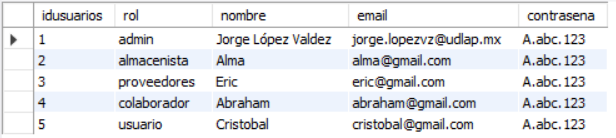
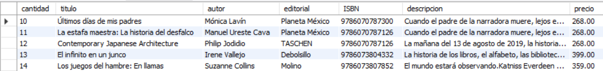

# Post-Data - Base de datos.

- Diagrama EER


Para probarlo, se deberá ejecutar el archivo Instalar.sql Ahí se instalará la base de datos postdata, junto con las tablas y 5 registros por tabla.

# Realizando consultas de prueba.
Consulta de usuarios y sus roles.
```sql
SELECT usuarios.idusuarios, roles.rol, usuarios.nombre, usuarios.email, usuarios.contrasena
FROM usuarios
INNER JOIN roles 
ON usuarios.roles_idroles = roles.idroles;
```


Consulta de los libros y su inventario.
```sql
SELECT inventario.cantidad, libros.titulo, libros.autor, libros.editorial, libros.ISBN, libros.descripcion, libros.precio
FROM libros
INNER JOIN inventario 
ON libros.idlibros = inventario.libros_idlibros;
```
